# Лабораторная работа №2. Облачные вычислительные сервисы. Amazon EC2

## Шапка

| | |
|---|---|
| **ФИО** | Каралащук Илья |
| **Группа** | IA2403 |
| **Специальность** | Informatică aplicată |
| **Уровень** | Продвинутый |
| **Приложение** | TimeCapsule (`open_capsules_php_functional`, PHP без фреймворка) |
| **Вариант деплоя** | A (вручную) |
| **Репозиторий** | https://github.com/iliuha-cloud/timecapsule |
| **Регион AWS** | eu-central-1 (Frankfurt) |

---

## 1. Скриншоты базового уровня

### Задание 1. Бюджет ZeroSpend
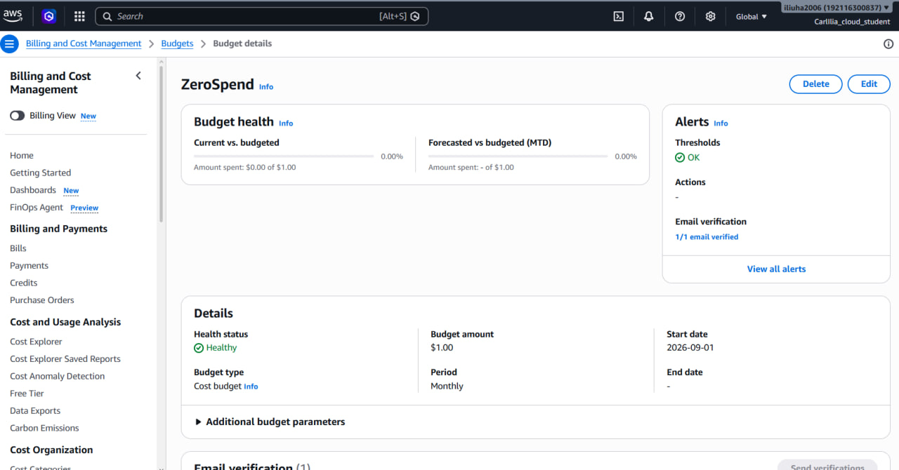
Бюджет `ZeroSpend` (шаблон Zero spend budget) создан и отображается в списке Budgets.

### Задание 2. Экземпляр EC2
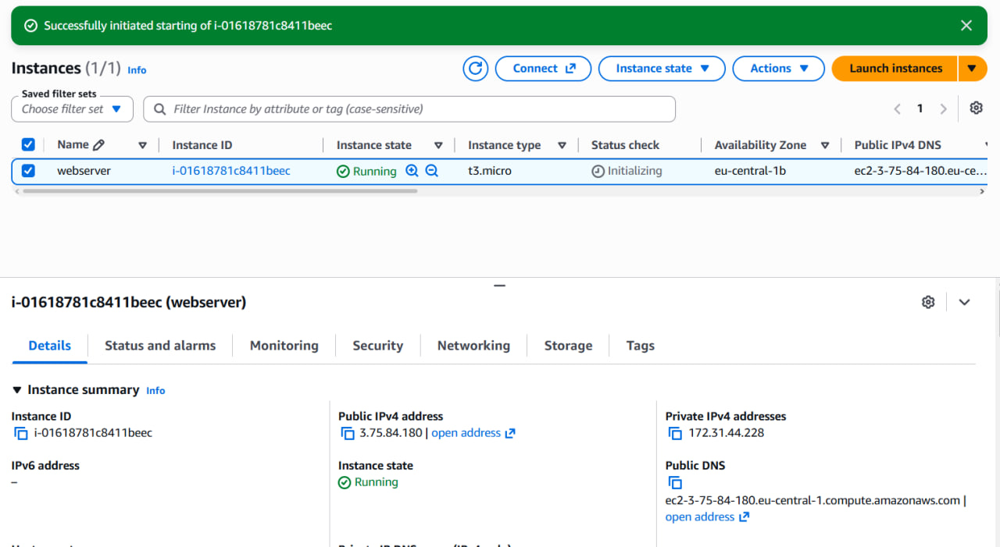
Экземпляр `webserver` в состоянии Running, все проверки Status check пройдены (2/2 checks passed), виден Instance ID и публичный IP.

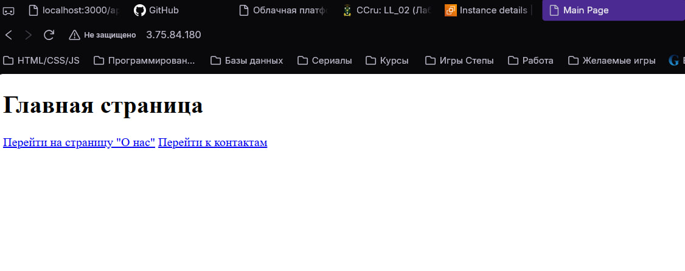
Приветственная страница nginx открывается по `http://<Public-IP>`.

### Задание 3. Мониторинг и диагностика

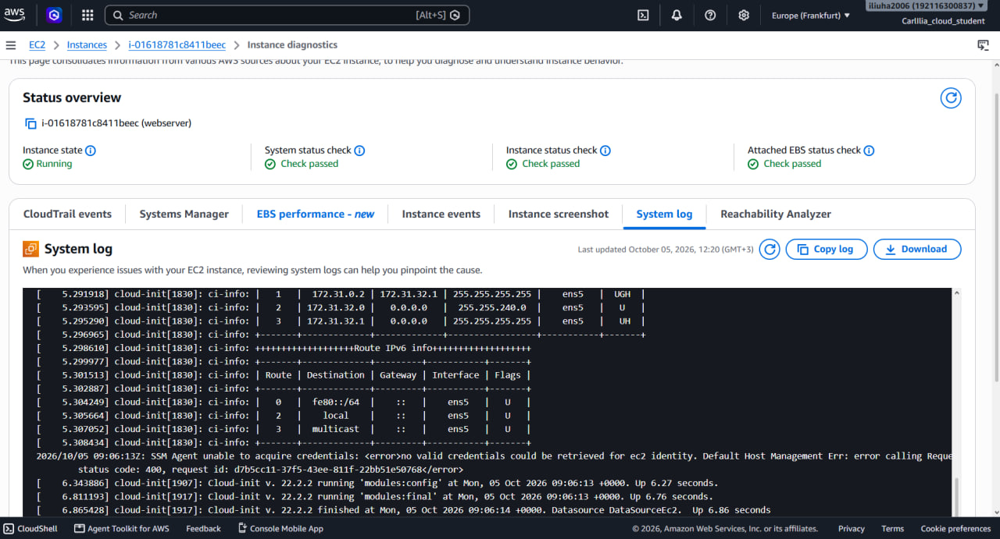
Фрагмент System log, где `dnf` устанавливает nginx из скрипта User data.

### Задание 4. SSH
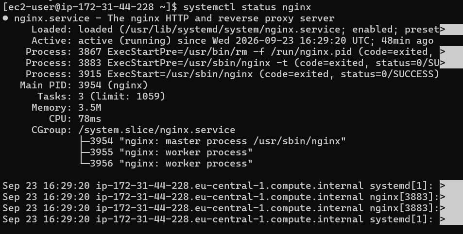
Успешное подключение под `ec2-user` и вывод `systemctl status nginx` (active (running)).

### Задание 5. Статический сайт

Собственный сайт из трёх страниц (`index.html`, `about.html`, `contact.html`) открывается по публичному IP.

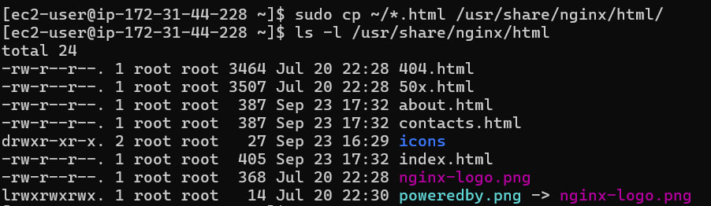
Вывод `ls -l /usr/share/nginx/html`: HTML-файлы скопированы в каталог nginx.

### Задание 6. AWS CLI
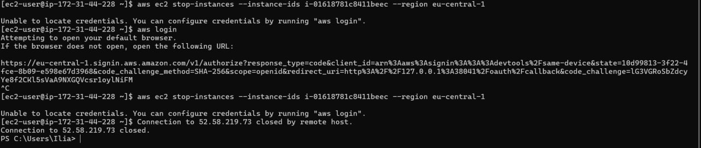
Команда `aws ec2 stop-instances --instance-ids <ID> --region eu-central-1` и её вывод (состояние `stopping`).

---

## 2. Скриншоты продвинутого уровня

### Задание 9. PostgreSQL
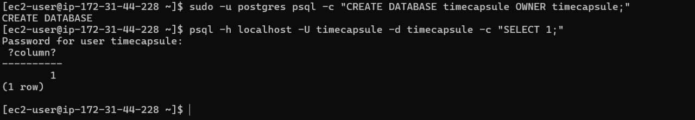
Подключение к БД по паролю: `psql -h localhost -U timecapsule -d timecapsule -c "SELECT 1;"` вернула таблицу с числом 1.

### Задание 10. Развёртывание кода
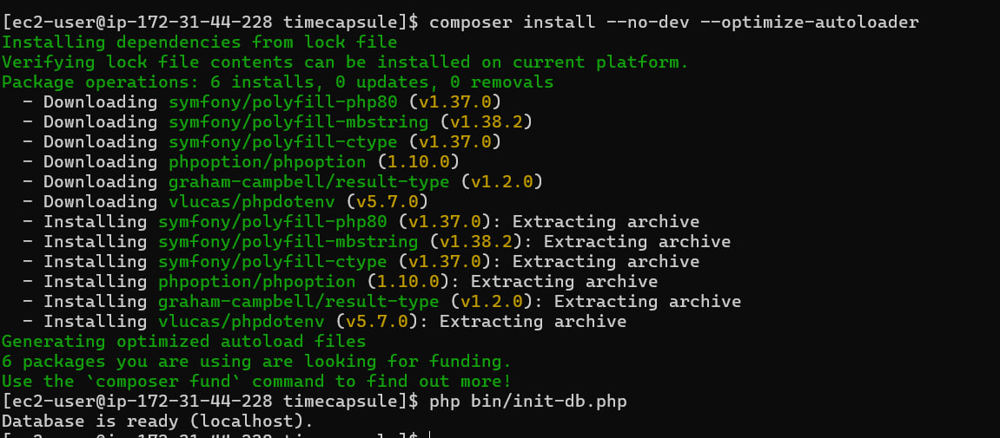
Вывод `php bin/init-db.php`: `Database is ready`.

### Задание 11. nginx и приложение
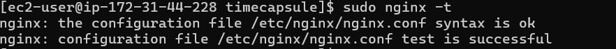
Вывод `sudo nginx -t`: синтаксис конфигурации корректен (syntax is ok, test is successful).

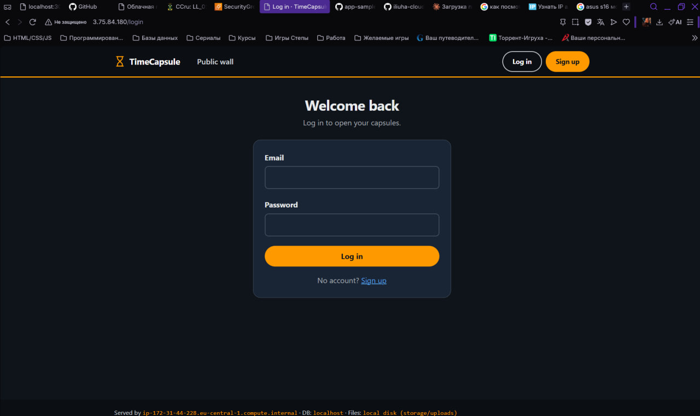
Страница входа TimeCapsule по `http://<Public-IP>`.

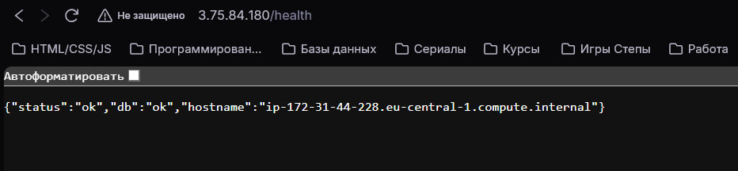
Ответ `/health`: `{"status":"ok","db":"ok",...}`.

### Задание 13. Новая версия, поломка, откат
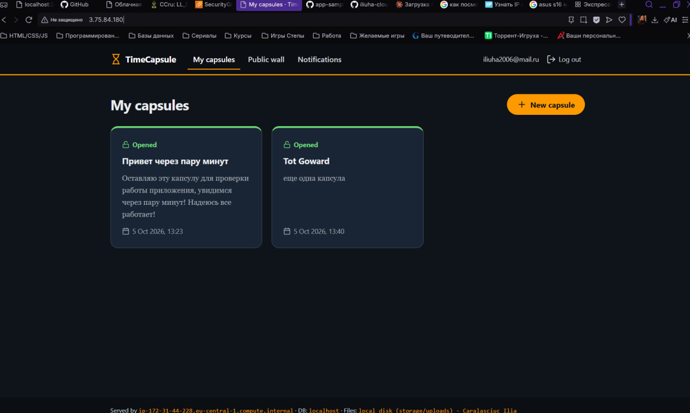
Страница с моим изменением в подвале (имя автора); ранее созданная капсула с файлом на месте.

---

## 3. Архитектура

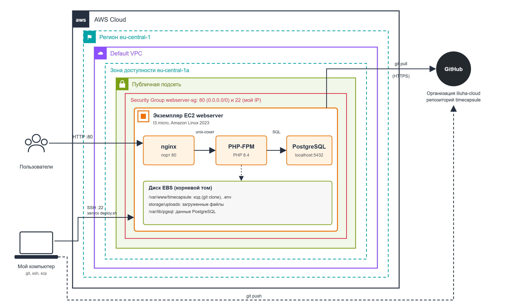

Что есть на схеме:

- Пользователи → HTTP (порт 80) → экземпляр EC2.
- Контур **AWS Cloud** → **Region eu-central-1** → **default VPC** → **Availability Zone** → **Public subnet** → **Security Group `webserver-sg`** (22 с My IP, 80 с 0.0.0.0/0).
- Внутри EC2: **nginx** → (unix-сокет `/run/php-fpm/www.sock`) → **PHP-FPM** → (localhost:5432) → **PostgreSQL**. Рядом: каталог `storage/uploads` на EBS-томе.
- **GitHub** (организация `iliuha-cloud`, репозиторий `timecapsule`) вне AWS; стрелка от EC2 к GitHub: `git pull` по HTTPS.
- **Мой компьютер**: стрелка `git push` в GitHub и стрелка «запуск деплоя по SSH» (порт 22) на EC2.

**ADR:** [docs/adr/0001-deploy-method.md](docs/adr/0001-deploy-method.md)

---

## 4. Ответы на контрольные вопросы

### Задание 1

**Что разрешает политика AdministratorAccess? Почему для повседневной работы нельзя использовать root?**
`AdministratorAccess` разрешает любые действия над любыми ресурсами аккаунта (`Action: *`, `Resource: *`), то есть это полный доступ ко всем сервисам. Root-пользователь сильнее, потому что его права нельзя ограничить политиками, а компрометация его пароля означает потерю всего аккаунта, включая биллинг и закрытие аккаунта. Пользователь IAM можно ограничить, отозвать у него ключи и отследить его действия, поэтому root оставляют только для редких задач, доступных только ему, и защищают MFA.

### Задание 2

**Что такое User data и когда выполняется этот скрипт? Выполнится ли он повторно после перезагрузки?**
User data - это скрипт или набор настроек, который передаётся экземпляру при запуске; его выполняет агент cloud-init с правами root. По умолчанию он выполняется один раз, при самом первом старте экземпляра. После перезагрузки (и после Stop/Start) он повторно не выполнится, если специально не настроить cloud-init на запуск при каждой загрузке.

### Задание 3

**Какая проверка укажет на проблему, которую можете исправить вы, а какая - на проблему на стороне AWS?**
System status check показывает проблемы инфраструктуры AWS (физический сервер, сеть, питание); обычно их решают остановкой и запуском экземпляра, чтобы он переехал на другой хост, либо ждут исправления со стороны AWS. Instance status check показывает проблемы внутри самой виртуальной машины (ОС не загрузилась, неверная настройка сети или файловой системы, kernel panic), и их исправляем мы. Attached EBS status check отслеживает доступность подключённых томов.

**В каких случаях стоит включать детальный мониторинг?**
Когда важна быстрая реакция: у боевых сервисов, при автоскейлинге и настройке алармов, при коротких всплесках нагрузки, которые теряются в 5-минутной агрегации. Для учебного сервера он не нужен: он платный, а базового мониторинга достаточно.

### Задание 4

**Почему для входа на EC2 используется ключ, а не пароль?**
Пароль можно подобрать перебором, а в интернете серверы постоянно сканируют боты. Приватный ключ ED25519 подобрать практически невозможно, он никогда не передаётся по сети (на сервере лежит только публичная часть), а вход по паролю в образах Amazon Linux по умолчанию отключён. Ключ также удобно выдавать и отзывать, не меняя общий пароль.

### Задание 5

**Что делает команда scp и чем она похожа на ssh?**
`scp` копирует файлы между компьютером и сервером. Она работает поверх протокола SSH: использует тот же порт 22, тот же ключ (`-i`), то же шифрование и ту же аутентификацию. Разница в назначении: `ssh` открывает удалённую командную строку, а `scp` передаёт файлы.

### Задание 6

**Чем Stop отличается от Terminate? За что вы платите, пока экземпляр остановлен?**
Stop выключает экземпляр, но он остаётся в аккаунте вместе с EBS-диском, и его можно запустить снова (публичный IP при этом изменится). Terminate удаляет экземпляр навсегда, а корневой том по умолчанию удаляется вместе с ним. В остановленном состоянии мы не платим за вычисления (CPU/RAM), но платим за хранение EBS-томов, снапшоты и за Elastic IP/публичные IPv4-адреса, если они закреплены.

### Задание 8

**Почему мы устанавливаем пакеты вручную, а не добавляем в User data?**
User data выполняется один раз при первом запуске, а наш экземпляр уже создан, поэтому скрипт не сработает повторно. Кроме того, отладка User data неудобна: ошибки видны только в логах cloud-init, а вручную мы видим вывод сразу и учимся понимать каждый шаг. Для воспроизводимого развёртывания лучше позже использовать собственный AMI или инфраструктуру как код.

### Задание 10

**Почему пароль к БД хранится в `.env` на сервере, а не в коде в репозитории? Почему публичный репозиторий безопасен для этого приложения?**
Всё, что попало в git, остаётся в истории навсегда и видно всем, а в публичном репозитории - всему интернету. Поэтому секреты живут только на сервере в `.env`, который указан в `.gitignore`, а у каждого окружения (разработка, сервер) свои значения. Репозиторий безопасен, потому что содержит только код и файл-шаблон `.env.example` без реальных значений; к тому же через nginx снаружи доступна только папка `public`, а доступ к скрытым файлам запрещён.

**(Из задания 7) Почему `vendor/` и `.env` не попали в репозиторий?**
Оба пути перечислены в `.gitignore`. `vendor/` содержит скачанные библиотеки, их можно восстановить командой `composer install` по `composer.lock`, и хранить их в git незачем. `.env` содержит секреты, которые нельзя публиковать.

### Задание 12

**Что увидит посетитель во время `git pull`? Что случится, если после `git pull` не выполнится `composer install`?**
`git pull` заменяет файлы по одному, поэтому в течение нескольких секунд на сервере лежит смесь старых и новых файлов. Посетитель в этот момент может получить ошибку 500 или неработающую страницу. Если после `git pull` не выполнится `composer install`, новый код может требовать библиотек, которых нет в `vendor/`, и сайт упадёт с ошибкой (например, `vendor/ is missing` или fatal error о ненайденном классе) до тех пор, пока зависимости не будут установлены.

### Задание 13

**Почему `/health` отвечает ok, хотя главная страница не работает? Что на самом деле проверяет этот адрес? Чего не хватает?**
`/health` - это отдельный лёгкий обработчик, который проверяет только то, что PHP-FPM запущен и приложение может подключиться к базе. Он не подключает `views/layout.php`, поэтому синтаксическая ошибка в шаблоне его не затрагивает. Такой проверке не хватает проверки реальных пользовательских сценариев: например, запроса главной страницы с ожиданием кода 200 и нужного текста (smoke test), проверки отрисовки шаблонов и записи файлов.

**Сколько времени сайт был сломан? Из каких шагов сложилось это время? Как сократить?**
Сайт был сломан примерно **5 минут**. Время складывается из: деплоя сломанного коммита → обнаружения ошибки (открыть сайт и увидеть 500) → `git revert` → `git push` → повторного деплоя на сервере. Сократить его можно: проверять синтаксис (`php -l`) и тесты в CI до деплоя, делать автоматический smoke test после деплоя с автоматическим откатом, использовать мониторинг и алерты, выкладывать новую версию в отдельный каталог и переключать символическую ссылку (быстрый откат и без «полупрозрачного» состояния).

### Устные вопросы

**1. Как проходит запрос от браузера до базы данных?**
Браузер отправляет HTTP-запрос на публичный IP, порт 80; Security Group пропускает его на экземпляр. nginx принимает запрос: статические файлы отдаёт сам, остальные запросы (`try_files` → `index.php`) передаёт по unix-сокету в PHP-FPM. PHP-FPM выполняет `public/index.php`, приложение по логину и паролю из `.env` подключается к PostgreSQL на `localhost:5432`, получает данные, формирует HTML и возвращает его через nginx браузеру.

**2. Почему сервер может скачивать код, но не может отправлять изменения? Почему это правильно?**
Публичный репозиторий читается любым человеком по HTTPS без авторизации, а для записи нужен вход в GitHub, учётных данных которого на сервере нет. Это принцип минимальных привилегий: если сервер взломают, злоумышленник не сможет изменить код в репозитории и подсунуть вредоносные изменения всем, кто его использует. Единственный источник кода остаётся под контролем разработчиков.

**3. Что станет с загруженными файлами, если удалить экземпляр EC2? Как это связано с EBS?**
Файлы лежат в `storage/uploads` на корневом томе EBS, а при Terminate корневой том по умолчанию удаляется вместе с экземпляром (флаг Delete on termination). Значит, пропадут и загруженные файлы, и сама база PostgreSQL. При обычном Stop/Start данные сохраняются, так как EBS - это постоянное блочное хранилище. Для защиты от потери нужны снапшоты EBS, отдельный том, а в будущем вынос файлов в S3 и базы в RDS.

**4. Что общего у моего деплоя с CI/CD? Чего не хватает?**
Те же шаги: забрать код из репозитория, поставить зависимости, выполнить миграции БД, перезапустить сервис, а CI/CD-системы делают это на каком-то сервере по команде, как наша команда `ssh ... ./deploy.sh`. Не хватает автоматического запуска по `git push`, автоматических тестов и проверок до выкладки, проверки здоровья после деплоя и автоматического отката, тестового окружения, управления секретами, уведомлений и журнала деплоев.

---

## 5. Ссылки

- Репозиторий приложения: https://github.com/iliuha-cloud/timecapsule
- ADR: [docs/adr/0001-deploy-method.md](docs/adr/0001-deploy-method.md)
- Условие лабораторной работы и лекция 4 (Amazon EC2 и machine identity)
- Документация AWS EC2: https://docs.aws.amazon.com/ec2/
